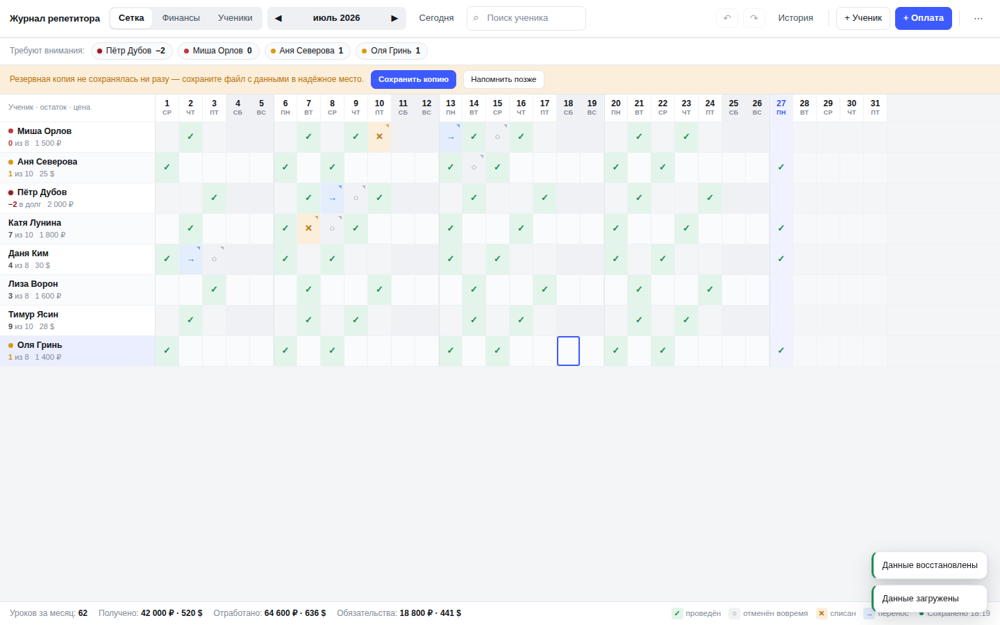
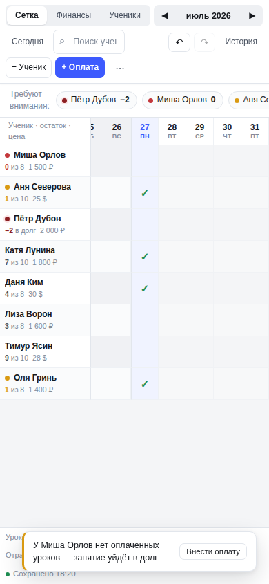

# Журнал репетитора

Учёт занятий, пакетов уроков и оплат для частного репетитора — всё на одном
экране. Одно приложение в одном файле: на компьютере выглядит как настольная
программа, на телефоне — как мобильное приложение.

## Открыть

**Сайт (он же установка на телефон):**
**https://mpz34-stack.github.io/Teacherdesk/**

- **iPhone (Safari):** открыть адрес → «Поделиться» → «На экран “Домой”».
- **Android (Chrome):** открыть адрес → меню ⋮ → «Добавить на главный экран».

После установки работает без интернета, с собственной иконкой.

**На компьютере:** можно пользоваться тем же адресом, а можно скачать
`index.html` (кнопка Code → Download ZIP), переименовать в
«Журнал репетитора.html» и открывать двойным кликом — без интернета.

## Возможности

- Сетка «ученики × дни»: клик (тап) — урок прошёл и списан с баланса,
  правый клик (длинное нажатие) — отмены, переносы, заметки.
- Пакеты уроков: FIFO-списание, индикаторы «остался 1 урок / уроки кончились /
  занимается в долг», полоса «Требуют внимания».
- Финансовый монитор: доход и часы за 6/12/24 мес. или всё время, раздельно
  по ₽ и $, три графика по месяцам, вклад каждого ученика.
- Архив учеников с полной метрикой без календаря.
- Журнал изменений (только на добавление), undo/redo, автосохранение,
  автоснимки данных, экспорт/импорт JSON и CSV.

## Данные и приватность

Данные **не лежат в этом репозитории** и никуда не отправляются: журнал хранит
их в браузере того устройства, где вы работаете (плюс необязательная привязка
к JSON-файлу на диске в Chrome/Edge). Телефон и компьютер не синхронизируются —
перенос через ⋯ → «Сохранить копию (JSON)» → «Импорт из файла…».

## Файлы

| Файл | Назначение |
|---|---|
| `index.html` | Всё приложение целиком (HTML+CSS+JS, без зависимостей) |
| `manifest.webmanifest`, `sw.js`, `icon-*.png` | Установка на телефон и офлайн-режим |
| `DESIGN.md` | Дизайн-документ: модель данных, логика списания, схема БД |
| `BUILD_PROMPT.md` | Промт для сборки нативной версии (Tauri, .msi/.dmg) |
| `REVIEW.md` | Дизайн-ревью, отчёт о тестировании, ревью решения |
| `check.js` | 140 автотестов (Playwright): `npm i playwright && node check.js` |

## Обновление сайта

Изменили `index.html` → закоммитьте в `main` — Pages пересоберётся сам за
минуту-две. Данные пользователей при обновлении не затрагиваются.
